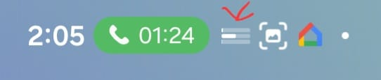
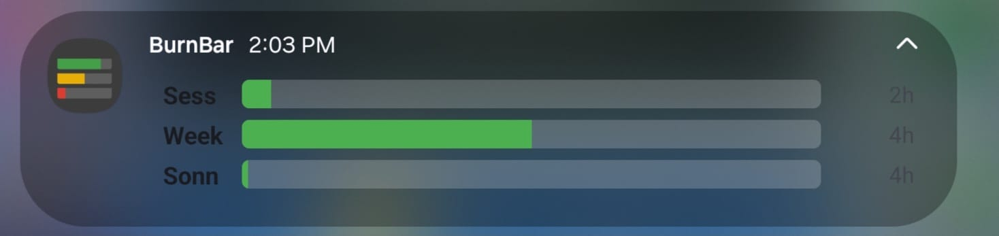

# BurnBar

Tired of alt-tabbing to claude.ai and mashing refresh to see if you boutta get rate limited? Watch it 🔥 burn 🔥 in real-time instead.

### Windows


### Android
| Status Bar | Notification |
|:---:|:---:|
|  |  |

Always-on-top overlay for **Windows** and persistent notification for **Android** that shows your Claude usage at a glance.

## What It Does

BurnBar monitors your Claude rate limits and displays them as three color-coded bars in a small, draggable overlay window:

| Left | Bar | Right | Description |
|------|-----|-------|-------------|
| **Sess** | usage fill | reset countdown | 5-hour rolling session window |
| **Week** | usage fill | reset countdown | 7-day all-models window |
| **Sonn** | usage fill | reset countdown | 7-day Sonnet-specific window |

The label on the left identifies each rate-limit window. The bar fills left-to-right as usage increases, shifting from green to yellow to red based on configurable thresholds. The countdown on the right shows time until that window resets (`Xd`, `Xh`, or `Xm`).

In the red zone the overlay flashes; in the critical zone (<=3%) it flashes faster.

Right-click the overlay for a menu with detailed stats, settings, and manual refresh. Hover for a tooltip breakdown.

## Authentication

BurnBar supports two modes:

- **OAuth (Claude Max plan)** -- reads the unified rate-limit headers (`anthropic-ratelimit-unified-*`). Auto-imports credentials from Claude Code on first launch.
- **API Key** -- reads standard `anthropic-ratelimit-tokens-*` headers via a minimal API call.

## Quick Start

### Windows

Download `BurnBar-Setup.exe` from the [latest release](https://github.com/apresence/burnbar/releases/latest) and run it. Installs to `%LocalAppData%\BurnBar` with a Start Menu shortcut and uninstaller -- no admin rights needed. You can also grab the standalone `BurnBar.exe` if you prefer no installation.

On first launch, BurnBar positions itself above the taskbar in the bottom-right corner. Drag it wherever you like -- the position is saved automatically.

If you have Claude Code installed, BurnBar auto-imports your OAuth credentials on first launch. Otherwise, right-click the overlay and open Settings to configure.

### Android

Download `BurnBar.apk` from the [latest release](https://github.com/apresence/burnbar/releases/latest) and sideload it.

#### Sideloading

1. On your Android device, go to **Settings > Apps > Special app access > Install unknown apps** (path varies by manufacturer).
2. Enable install permission for your browser or file manager.
3. Download and open `BurnBar.apk` -- tap **Install** when prompted.
4. If you see "App not verified" / Play Protect warning, tap **Install anyway**. This is normal for apps distributed outside the Play Store.

On first launch, enter your API key or OAuth credentials in Settings. BurnBar runs as a foreground service with a persistent notification showing your three usage bars.

### Run from Source

Requires Python 3.10+ and Windows 10/11.

```bash
pip install -r requirements.txt
pythonw main.pyw
```

Use `python main.pyw` instead for console debug output.

### Configure

Right-click the overlay > **Settings**:

| Setting | Default | Description |
|---------|---------|-------------|
| Auth Mode | OAuth | OAuth (Max plan) or API Key |
| Poll Interval | 60 sec | How often to check usage (min 10 sec) |
| Yellow Threshold | 25% | Bars turn yellow below this remaining % |
| Red Threshold | 5% | Bars turn red below this remaining % |
| Critical Threshold | 3% | Faster flash below this remaining % |

## Config File

`%APPDATA%\BurnBar\config.json`

Sensitive values (API key, OAuth tokens) are encrypted at rest using Windows [DPAPI](https://learn.microsoft.com/en-us/windows/win32/api/dpapi/). If you paste a plaintext token into the config file, it will be automatically encrypted the next time BurnBar starts.

## Build

### Windows

```bash
build.bat
iscc installer.iss
```

1. `build.bat` runs PyInstaller and produces `dist\BurnBar.exe`.
2. `iscc installer.iss` runs [Inno Setup](https://jrsoftware.org/isdl.php) and produces `dist\BurnBar-Setup.exe`.

### Android

Requires JDK 17 and Android SDK (build-tools 35, platform android-35).

```bash
cd android
./gradlew assembleRelease
```

The signed APK is written to `android/app/build/outputs/apk/release/app-release.apk`.

## Project Structure

```
main.pyw                 # Entry point
requirements.txt         # Dependencies
build.bat                # PyInstaller build script
installer.iss            # Inno Setup installer script
burnbar/
    app.py               # Application controller, polling loop, flash logic
    api_client.py        # Anthropic API client (OAuth + API key)
    overlay.py           # Always-on-top tkinter overlay window
    config.py            # Settings persistence
    settings_dialog.py   # tkinter settings window
    oauth.py             # OAuth 2.0 + PKCE, Claude Code credential import
    startup.py           # Windows auto-start (registry)
android/
    app/src/main/java/com/apresence/burnbar/
        BurnBarApp.kt        # Application class
        MainActivity.kt      # Launcher activity (Jetpack Compose)
        service/
            BurnBarService.kt    # Foreground service, notification bars
        api/
            AnthropicApiClient.kt  # API client + OAuth
            UsageModels.kt         # Rate limit data models
        data/
            Preferences.kt    # Encrypted shared preferences
        ui/
            SettingsScreen.kt  # Compose settings UI
            theme/             # Material3 theming
```

## Notes

- **Single instance**: A Windows mutex prevents multiple copies from running.
- **Sonnet headers**: The `7d_sonnet` utilization headers only appear when probing with a Sonnet-class model, so OAuth mode uses `claude-sonnet-4-6` for its probe request.
- **Overlay**: Frameless, semi-transparent, always-on-top, draggable. Position persists across restarts. On first launch, auto-positions above the taskbar in the bottom-right corner.
