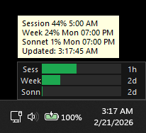

# BurnBar

Tired of alt-tabbing to claude.ai and mashing refresh to see if you boutta get rate limited? Watch it 🔥 burn 🔥 in real-time instead.



Always-on-top overlay for Windows that shows your Claude usage at a glance.

## What It Does

BurnBar monitors your Claude rate limits and displays them as three color-coded bars in a small, draggable overlay window:

| Left | Bar | Right | Description |
|------|-----|-------|-------------|
| **Sess** | usage fill | reset countdown | 5-hour rolling session window |
| **Week** | usage fill | reset countdown | 7-day all-models window |
| **Sonn** | usage fill | reset countdown | 7-day Sonnet-specific window |

The label on the left identifies each rate-limit window. The bar fills left-to-right as usage increases, shifting from green to yellow to red based on configurable thresholds. The countdown on the right shows time until that window resets (`Xd`, `Xh`, or `Xm`).

In the red zone the overlay flashes; in the critical zone (<=3%) it flashes faster.

Right-click the overlay for a menu with detailed stats, settings, and manual refresh. Hover for a tooltip breakdown.

## Authentication

BurnBar supports two modes:

- **OAuth (Claude Max plan)** -- reads the unified rate-limit headers (`anthropic-ratelimit-unified-*`). Auto-imports credentials from Claude Code on first launch.
- **API Key** -- reads standard `anthropic-ratelimit-tokens-*` headers via a minimal API call.

## Quick Start

### Requirements

- Python 3.10+
- Windows 10/11

### Install and Run

```bash
pip install -r requirements.txt
pythonw main.pyw
```

Use `pythonw` to run without a console window. Use `python main.pyw` for debug output.

On first launch, BurnBar positions itself above the taskbar in the bottom-right corner. Drag it wherever you like -- the position is saved automatically.

On first launch with OAuth mode, BurnBar auto-imports credentials from Claude Code (`~/.claude/.credentials.json`). If no credentials are found, right-click the overlay and open Settings.

### Configure

Right-click the overlay > **Settings**:

| Setting | Default | Description |
|---------|---------|-------------|
| Auth Mode | OAuth | OAuth (Max plan) or API Key |
| Poll Interval | 60 sec | How often to check usage (min 10 sec) |
| Yellow Threshold | 25% | Bars turn yellow below this remaining % |
| Red Threshold | 5% | Bars turn red below this remaining % |
| Critical Threshold | 3% | Faster flash below this remaining % |

## Config File

`%APPDATA%\BurnBar\config.json` (Windows) or `~/.config/burnbar/config.json` (Linux/macOS).

## Build Standalone Executable

```bash
build.bat
```

Produces `dist\BurnBar.exe` via PyInstaller.

## Project Structure

```
main.pyw                 # Entry point
requirements.txt         # Dependencies
build.bat                # PyInstaller build script
burnbar/
    app.py               # Application controller, polling loop, flash logic
    api_client.py        # Anthropic API client (OAuth + API key)
    overlay.py           # Always-on-top tkinter overlay window
    config.py            # Settings persistence
    settings_dialog.py   # tkinter settings window
    oauth.py             # OAuth 2.0 + PKCE, Claude Code credential import
    startup.py           # Windows auto-start (registry)
```

## Notes

- **Single instance**: A Windows mutex prevents multiple copies from running.
- **Sonnet headers**: The `7d_sonnet` utilization headers only appear when probing with a Sonnet-class model, so OAuth mode uses `claude-sonnet-4-6` for its probe request.
- **Overlay**: Frameless, semi-transparent, always-on-top, draggable. Position persists across restarts. On first launch, auto-positions above the taskbar in the bottom-right corner.
